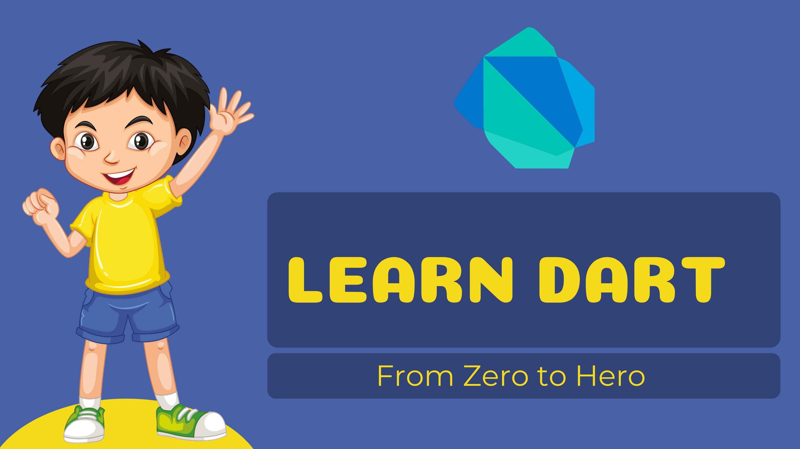

# DART TUTORIAL
_Learn Dart, the most well-known language of the industry today. A solid understanding of Dart helps to build quality apps with flutter. Start your journey with this dart tutorial._ 
*[Click here](https://dart-tutorial.com/) to get started.*

## Why Should You Learn Dart?
* Free and open source.
* To be comfortable in a flutter.
* To develop multi-platform apps for android, iOS, windows, mac, Linux, etc.
* Fastest growing programming language.
* It has rich set of libraries and tools.
* Huge community support.

## How Much Time Does It Take to Learn Dart?
Generally, learning programming takes 2-3 months. You can catch up in a few weeks if you know another programming language like java, c#, javascript, etc.

## Question For Practice
At the end of the session, we provide you with challenges for Dart, and they will help you to improve what you're learning. Completing these questions will help you to master Dart.

## Accelerate your Workflow
Save any snippet in this tutorial to your personal micro-repository with Pieces for Developers to speed up your workflow. Pieces is a centralized productivity suite that leverages AI to help developers save snippets, extract code from screenshots, auto-enrich code, and much more.
